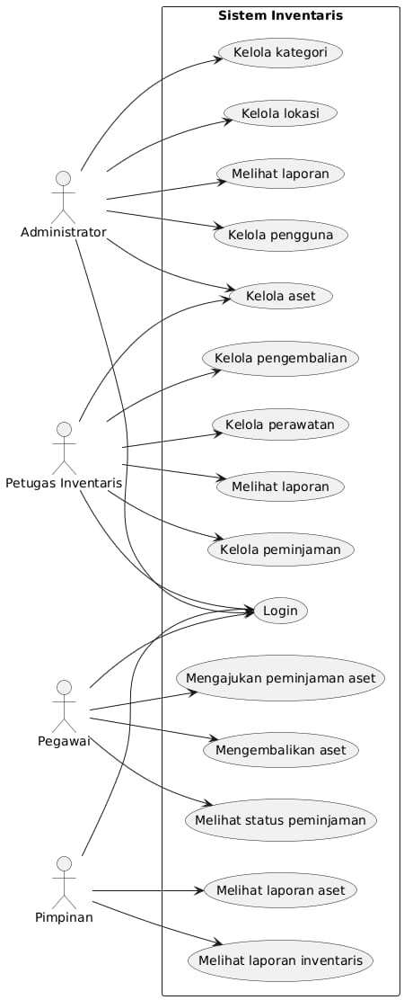

# PROGRES 1 – ANALISIS KEBUTUHAN SISTEM

## Sistem Manajemen Aset dan Barang Inventaris Kantor

---

# 1. Deskripsi Studi Kasus

Sebuah kantor memiliki berbagai aset dan barang inventaris seperti komputer, laptop, printer, meja, kursi, proyektor, kendaraan operasional, dan perangkat pendukung lainnya. Saat ini pencatatan aset masih dilakukan secara manual menggunakan buku atau spreadsheet sehingga sering terjadi masalah seperti kehilangan data, kesulitan mencari informasi aset, keterlambatan pelaporan, serta kurang akuratnya informasi kondisi dan lokasi aset.

Untuk mengatasi permasalahan tersebut diperlukan sebuah Sistem Manajemen Aset dan Barang Inventaris Kantor yang dapat membantu proses pendataan, pemantauan, peminjaman, pengembalian, perawatan, serta pelaporan aset secara terkomputerisasi.

---

# 2. Latar Belakang dan Tujuan Sistem

## 2.1 Latar Belakang

Aset dan inventaris merupakan sumber daya penting yang mendukung operasional kantor. Pengelolaan aset yang kurang baik dapat menyebabkan kerugian, kehilangan barang, serta kesulitan dalam pengambilan keputusan terkait pengadaan maupun perawatan aset.

Penggunaan sistem informasi berbasis database dapat membantu pengelolaan aset secara lebih efektif, efisien, dan terintegrasi sehingga seluruh data aset dapat diakses dengan mudah dan akurat.

## 2.2 Tujuan Sistem

Sistem ini bertujuan untuk:

1. Mengelola data aset dan inventaris secara terpusat.
2. Mencatat lokasi dan kondisi aset.
3. Mengelola proses peminjaman dan pengembalian aset.
4. Mencatat riwayat perawatan aset.
5. Memudahkan pencarian informasi aset.
6. Menghasilkan laporan inventaris secara cepat dan akurat.
7. Mengurangi risiko kehilangan data dan aset.
8. Membantu pengambilan keputusan terkait pengelolaan aset.

---

# 3. Identifikasi Aktor

| No | Aktor              | Deskripsi                                                    |
| -- | ------------------ | ------------------------------------------------------------ |
| 1  | Administrator      | Mengelola seluruh data sistem dan pengguna                   |
| 2  | Petugas Inventaris | Mengelola data aset, peminjaman, pengembalian, dan perawatan |
| 3  | Pegawai            | Melakukan peminjaman dan pengembalian aset                   |
| 4  | Pimpinan           | Melihat laporan dan data inventaris                          |

---

# 4. Kebutuhan Fungsional Sistem

Minimal 10 kebutuhan fungsional:

| No | Kebutuhan Fungsional                                                   |
| -- | ---------------------------------------------------------------------- |
| 1  | Sistem dapat melakukan login pengguna.                                 |
| 2  | Sistem dapat mengelola data pengguna.                                  |
| 3  | Sistem dapat menambah data aset baru.                                  |
| 4  | Sistem dapat mengubah data aset.                                       |
| 5  | Sistem dapat menghapus data aset.                                      |
| 6  | Sistem dapat menampilkan daftar aset.                                  |
| 7  | Sistem dapat mencatat peminjaman aset.                                 |
| 8  | Sistem dapat mencatat pengembalian aset.                               |
| 9  | Sistem dapat mencatat riwayat perawatan aset.                          |
| 10 | Sistem dapat mengelola kategori aset.                                  |
| 11 | Sistem dapat mengelola lokasi aset.                                    |
| 12 | Sistem dapat melakukan pencarian aset berdasarkan nama atau kode aset. |
| 13 | Sistem dapat menampilkan status aset (tersedia, dipinjam, rusak).      |
| 14 | Sistem dapat menghasilkan laporan inventaris.                          |
| 15 | Sistem dapat mencetak laporan aset.                                    |

---

# 5. Kebutuhan Data

Bagian ini sengaja dibuat agar sesuai dengan ERD dan database pada Progres 2 dan Progres 3.

## Data Pengguna (users)

| Atribut   |
| --------- |
| id_user   |
| nama_user |
| username  |
| password  |
| role      |

---

## Data Kategori Aset (kategori)

| Atribut       |
| ------------- |
| id_kategori   |
| nama_kategori |
| deskripsi     |

---

## Data Lokasi (lokasi)

| Atribut     |
| ----------- |
| id_lokasi   |
| nama_lokasi |
| keterangan  |

---

## Data Aset (aset)

| Atribut           |
| ----------------- |
| id_aset           |
| kode_aset         |
| nama_aset         |
| id_kategori       |
| id_lokasi         |
| tanggal_pengadaan |
| nilai_aset        |
| kondisi           |
| status            |

---

## Data Peminjaman (peminjaman)

| Atribut           |
| ----------------- |
| id_peminjaman     |
| id_aset           |
| id_user           |
| tanggal_pinjam    |
| tanggal_kembali   |
| status_peminjaman |

---

## Data Perawatan (perawatan)

| Atribut           |
| ----------------- |
| id_perawatan      |
| id_aset           |
| tanggal_perawatan |
| jenis_perawatan   |
| biaya             |
| keterangan        |

---

## Data Laporan

Data laporan diperoleh dari gabungan tabel:

* aset
* kategori
* lokasi
* peminjaman
* perawatan

---

# 6. Diagram Proses

## 6.1 Use Case Diagram

## Use Case Diagram



---

# 7. Pembagian Tugas Anggota

Karena anggota kelompok berjumlah 4 orang:

| Anggota   | Tugas                                                              |
| --------- | ------------------------------------------------------------------ |
| Anggota 1 | Deskripsi studi kasus, latar belakang, tujuan sistem               |
| Anggota 2 | Identifikasi aktor, kebutuhan fungsional                           |
| Anggota 3 | Kebutuhan data dan diagram proses                                  |
| Anggota 4 | Dokumentasi GitHub, penyusunan laporan, revisi dan integrasi tugas |

---

# 8. Link Repository GitHub

```text
https://github.com/Tosaveoc-bit/Sistem.Manajemen.Aset.dan.Barang.Inventaris.Kantor
```


